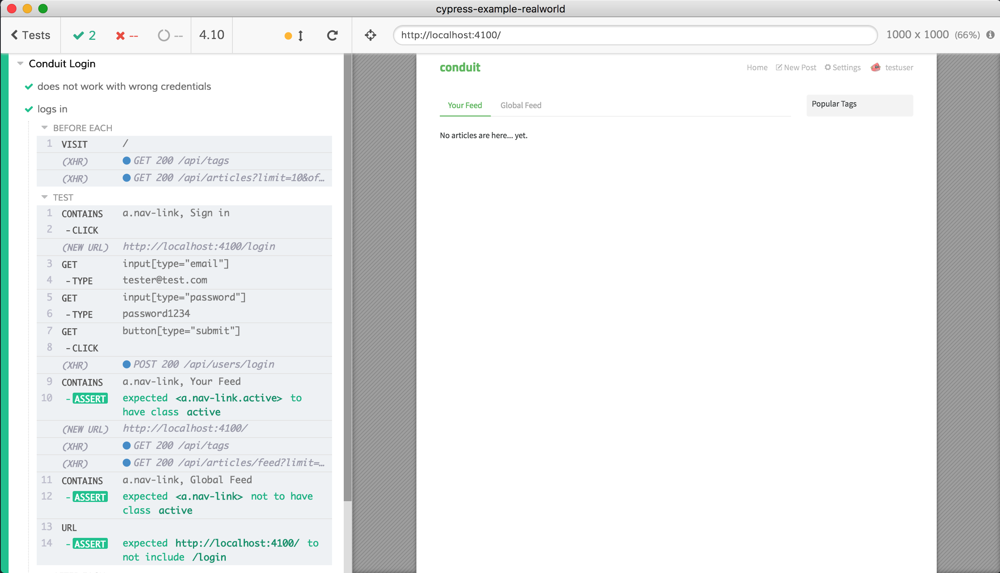

# Conduit App [![renovate-app badge][renovate-badge]][renovate-app]

Fork of [cypress-io/cypress-example-conduit-app](https://github.com/cypress-io/cypress-example-conduit-app) which is a fork of [gothinkster/realworld](https://github.com/gothinkster/realworld) "Conduit" blogging application.

## Tests

The tests are in [cypress/integration](cypress/integration) folder

- [feeds-spec.js](cypress/integration/feeds-spec.js) shows how to check the favorite articles feed and the global feed
- [follow-user-spec.js](cypress/integration/follow-user-spec.js) shows how to create two users and check if one user can follow the other
- [login-spec.js](cypress/integration/login-spec.js) checks if the user can log in via UI and via API
- [new-post-spec.js](cypress/integration/new-post-spec.js) verifies that a new article can be published and updated
- [profile-spec.js](cypress/integration/profile-spec.js) lets the user edit their profile
- [register-spec.js](cypress/integration/register-spec.js) tests if a new user can register
- [tags-spec.js](cypress/integration/tags-spec.js) checks if tags work
- [pagination-spec.js](cypress/integration/pagination-spec.js) creates many articles via API calls and then checks if they are displayed across two pages
- [force-logout-spec.js](cypress/integration/force-logout-spec.js) verifies that unauthorized API calls force the user session to finish

[renovate-badge]: https://img.shields.io/badge/renovate-app-blue.svg
[renovate-app]: https://renovateapp.com/
